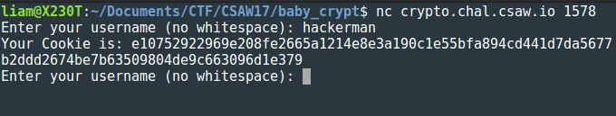
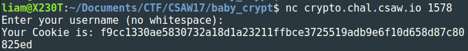
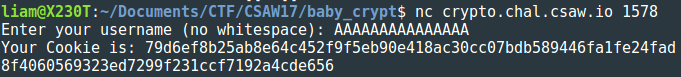
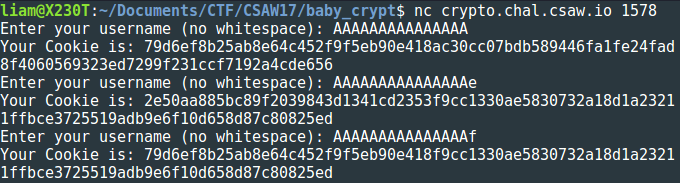
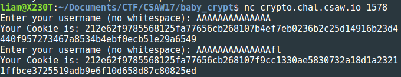

# baby_crypt
## Crypto - 350

#### The cookie is `input + flag` AES ECB encrypted with the sha256 of the flag as the key.
#### `nc crypto.chal.csaw.io 1578`

When we hit up the challenge server, we're prompted to enter a username. Our input is prepended to the flag then the whole plaintext is padded and run through AES in ECB mode. We're given the resulting ciphertext as a "cookie":



The vulnerability here is in how AES is used - [ECB mode](https://en.wikipedia.org/wiki/Block_cipher_mode_of_operation#Electronic_Codebook_.28ECB.29) (Electronic Code Book). Briefly, the ECB mode of operation breaks the plaintext up into 16 byte blocks and _independently_ encrypts each, producing a 16 byte ciphertext block for each plaintext block. So if we have key `k`, and `n` blocks of plaintext `m_1`, ..., `m_n`, we get `n` blocks of ciphertext, `c_1`, ..., `c_n` as follows:

```
(      m_1     )(      m_2     ) ... (      m_n     )
 \            /  \            /       \            /
  \          /    \          /         \          /
   enc(m_1, k)     enc(m_2, k)          enc(m_n, k)
  /          \    /          \         /          \
 /            \  /            \       /            \
(      c_1     )(      c_2     ) ... (      c_n     )
```

One benefit to using this mode of operation is that it can be parallelized, since the encryption of each block of plaintext is independent of all the others. However, this independence tells us that two blocks of ciphertext are the same if and only if their corresponding blocks of plaintext are the same. This correspondence is what will net us the flag.

First, let's see what happens when we enter a blank username:



We get 32 bytes of ciphertext, so our message is two 16 byte blocks (when padded). Let's pretend that we don't know that the message begins with `flag` and just represent the first block of the message with 16 consecutive `X`'s. If we enter 15 consecutive `A`'s as our username, the plaintext that gets encrypted will look like this:

```
(AAAAAAAAAAAAAAAX)(XXXXXXXXXXXXXXXY)(Y...
```

We have complete control over the first 15 bytes of the first block and the last byte is the first byte of the message. Let's throw this at the challenge server:



The first 15 bytes of ciphertext, `79d6ef8b25ab8e64c452f9f5eb90e418`, is the encryption of `AAAAAAAAAAAAAAAX`. To uncover the first byte of the message, we enter our 15 `A`'s again, now followed by a guess at what `X` might be:



By the one-to-one correspondence between plaintext and ciphertext blocks we discussed earlier, since the encryption of `AAAAAAAAAAAAAAAf` matches the encryption of `AAAAAAAAAAAAAAAX`, we have that `X` must be `f`.

To get the second byte of plaintext, we apply the same reasoning. We start by entering 14 `A`'s and recording the first 16 bytes of ciphertext. Then we send 14 `A`'s, followed by the first known byte of the message, `f`, followed by our guess at the second byte:



The second message byte must then be `l`. We continue in the same fashion to get the first block of the message.

We use the same idea to get the second block. We send 15 `A`'s, but this time we record the second 16 bytes of ciphertext. Then we send 15 `A`'s, followed by the first 16 bytes of the message, followed by our guess at the 17th byte. Repeat until the second 16 bytes of ciphertext match what we've recorded.

The moral of the story is don't use ECB mode.