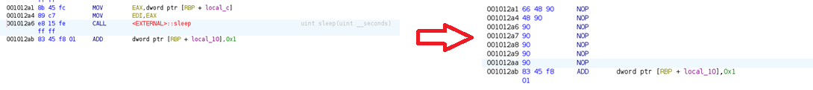

# Snail Delivery (Rev - 100)

> Enter your flag and the snail will deliver it to headquarters for verification. But be careful - it moves slowly!

---
## What we're given
We're given a single file, `snail` (a 64-bit ELF binary) that does the following.

1. Asks us for the flag
2. Shows us a cute ASCII snail running the flag to headquarters.
3. Who knows? The snail seems to take a really long time.


All we have is a binary, so hopefully we can disassemble it and see what's happening on the snail's journey.

---
## Disassembly - Ghidra

The `main` function is short enough that I don't feel completely stupid pasting the whole thing here.

```C
undefined8 main(void)

{
  char *pcVar1;
  undefined8 uVar2;
  size_t sVar3;
  byte local_178 [312];
  void *local_40;
  ulong local_38;
  ulong local_30;
  int local_24;
  ulong local_20;
  int local_14;
  int local_10;
  uint local_c;
  
  printf("Enter the flag: ");
  pcVar1 = fgets((char *)(local_178 + 0x30),0x100,stdin);
  if (pcVar1 == (char *)0x0) {
    uVar2 = 1;
  }
  else {
    sVar3 = strcspn((char *)(local_178 + 0x30),"\n");
    local_178[sVar3 + 0x30] = 0;
    puts("The snail is sending the flag to headquarters to check...");
    local_c = 1;
    for (local_10 = 0; local_10 < 0x10; local_10 = local_10 + 1) {
      local_c = local_c << 1;
      putchar(0xd);
      for (local_14 = 0; local_14 < local_10; local_14 = local_14 + 1) {
        putchar(0x5f);
      }
      printf("@>");
      fflush(stdout);
      sleep(local_c);
    }
    local_178[0x2d] = (byte)(local_c >> 0x10);
    local_178[0x2e] = (byte)(local_c >> 8);
    local_178[0x2f] = (byte)local_c;
    local_38 = strlen((char *)(local_178 + 0x30));
    local_40 = malloc(local_38 + 1);
    if (local_40 == (void *)0x0) {
      uVar2 = 1;
    }
    else {
      for (local_20 = 0; local_20 < local_38; local_20 = local_20 + 1) {
        *(byte *)(local_20 + (long)local_40) =
             local_178[local_20 + 0x30] ^ local_178[local_20 % 3 + 0x2d];
      }
      puts("\nWe have received it brother...");
      *(undefined1 *)(local_38 + (long)local_40) = 0;
      local_178[0x27] = 0x12;
      local_178[0x28] = 0x45;
      local_178[0x29] = 0x78;
      local_178[0x2a] = 0xab;
      local_178[0x2b] = 0xcd;
      local_178[0x2c] = 0xef;
      local_178[0] = 0x65;
      local_178[1] = 0x74;
      local_178[2] = 0xc;
      local_178[3] = 0xd1;
      local_178[4] = 0xbe;
      local_178[5] = 0x81;
      local_178[6] = 0x27;
      local_178[7] = 0x2c;
      local_178[8] = 0x14;
      local_178[9] = 0xf5;
      local_178[10] = 0xa9;
      local_178[0xb] = 0xdc;
      local_178[0xc] = 0x7f;
      local_178[0xd] = 0x74;
      local_178[0xe] = 0xe;
      local_178[0xf] = 0x99;
      local_178[0x10] = 0xbf;
      local_178[0x11] = 0x96;
      local_178[0x12] = 0x4c;
      local_178[0x13] = 0x36;
      local_178[0x14] = 0x14;
      local_178[0x15] = 0x9a;
      local_178[0x16] = 0xba;
      local_178[0x17] = 0xb0;
      local_178[0x18] = 0x27;
      local_178[0x19] = 0x23;
      local_178[0x1a] = 0x27;
      local_178[0x1b] = 0x99;
      local_178[0x1c] = 0xfb;
      local_178[0x1d] = 0xdb;
      local_178[0x1e] = 0x21;
      local_178[0x1f] = 0x75;
      local_178[0x20] = 0x4f;
      local_178[0x21] = 0x9c;
      local_178[0x22] = 0xff;
      local_178[0x23] = 0x8e;
      local_178[0x24] = 0x71;
      local_178[0x25] = 0x38;
      local_178[0x26] = 0;
      local_24 = 1;
      local_30 = 0;
      while( true ) {
        sVar3 = strlen((char *)(local_178 + 0x30));
        if (sVar3 <= local_30) break;
        if (((int)(char)local_178[local_30 + 0x30] ^ (uint)local_178[local_30 % 6 + 0x27]) !=
            (uint)local_178[local_30]) {
          local_24 = 0;
          break;
        }
        local_30 = local_30 + 1;
      }
      if (local_24 == 0) {
        printf("Wut is ts");
      }
      else {
        printf("We check it, it was correct bro: %s\n",local_40);
      }
      free(local_40);
      uVar2 = 0;
    }
  }
  return uVar2;
}
```

So the snail is slow because of the `sleep()` call inside that first `for` loop.
We can just patch that out completely in Ghidra by turning the `CALL` instruction into a `NOP`. Just to be safe, we `NOP` out the two `MOV` instructions preceding the `CALL` that presumably push the argument to `sleep()` into place.



Okay, but what about after the snail runs the flag?
Well apparently our input is stored at an offset of `0x30` into a buffer.
After the snail runs the flag, the program puts some stuff into the first `0x30` bytes of the buffer.
Then it performs a repeating key XOR on our input, using the last six of the first `0x30` bytes of the buffer as the key, and checks it against the first `0x30 - 6` bytes.
If this check succeeds, the program prints what it purports to be the flag (also obtained from XORing the input with some values obtained while the snail was running).

So we just undo the XOR to get the input that will give us the flag.

```python
key = bytes([0x12, 0x45, 0x78, 0xab, 0xcd, 0xef])
ct =  bytes([0x65, 0x74, 0xc, 0xd1, 0xbe, 0x81, 0x27, 0x2c,0x14,0xf5, 0xa9, 0xdc, 0x7f, 0x74, 0xe, 0x99,  0xbf,  0x96,  0x4c,  0x36,  0x14,  0x9a,  0xba,  0xb0,  0x27,  0x23,  0x27,  0x99,  0xfb,  0xdb,  0x21,  0x75,  0x4f,  0x9c,  0xff,  0x8e,  0x71,  0x38])

pt = bytes([ct[i] ^ key[i % len(key)] for i in range(len(ct))])
print("PT: ", pt.decode())
```


---

## Conclusion
Just basic binary patching, understanding where in a buffer a pointer is pointing to and XOR.