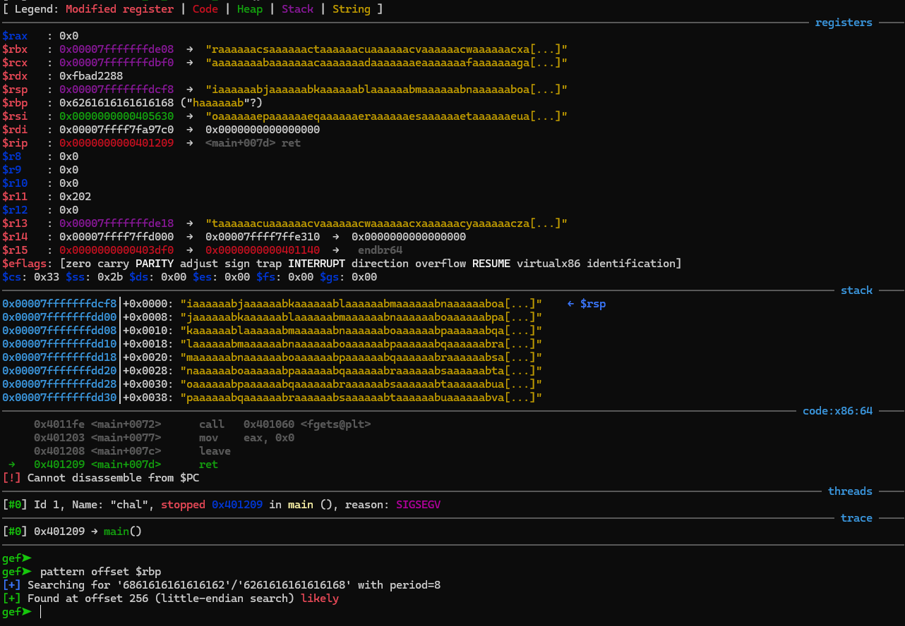
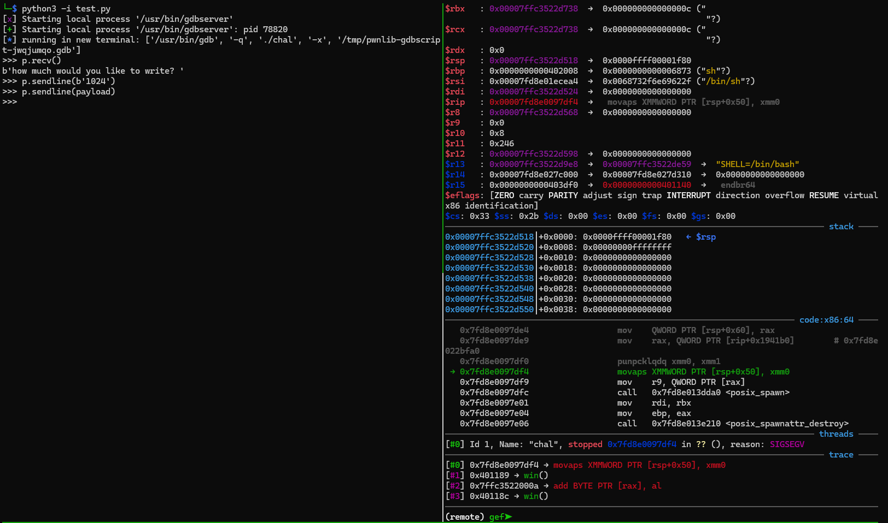

# Easy Bof (pwn - 50)

> Pwners sanity check.

---
## What we're given
We're given two files: a `C` source file, `chal.c` and the 64-bit binary `chal`.
The program does the following.

1. Prompts us for how many characters we want to enter (so we enter a number).
2. Takes some more input.

Checking out the source file, we see that there's a function `win()` (that is never called) that spawns a shell via `system("sh")`.
The program sets up a 256-byte buffer, but `fgets()` however many characters we want into it.
Textbook buffer overflow.


---
## Overflowing the buffer
Our plan is to write past the end of the buffer and overwrite the return address with the address of the `win()` function.
Once we're in the shell we just need to `cat flag`. 

First we need to get our bearings and find where the return address is relative to the buffer.
We open the binary in gdb (with [gef](https://github.com/hugsy/gef) in my case), create a huge blob (1024 bytes) of text with `pattern create` and throw it at the buffer.
This crashes the program, and upon checking out the registers in gdb, we see that the base pointer `rbp` has some ASCII text in it from our input.
The return address is 8 bytes after the base pointer on a 64-bit system, so once we have the offset for `rbp` we just add 8 to get the offset for the return address.
We do this by examining the contents of `rbp` and finding its location in our input pattern.



Cool, so the return address is stored 256 + 8 = 264 bytes into memory.
We want to replace this with the address of `win()`, which we can find by asking gdb nicely with `x win`.
```
gef➤  x win
0x401176 <win>: 0xe5894855
```

Cool, so a payload like `'A'*264 + b'\x76\x11\x40\x00\x00\x00\x00\x00'` (remember that addresses are little-endian) should do the trick, right?

---
## Byte-alignment
The program segfaults after sending that payload.



After googling the `movaps XMMWORD PTR [rsp+0x50], xmm0` message, I found that the issue is that the call to `system()` requires that the operand be aligned with a 16-byte boundary.
Indeed, here the value of `$rsp` is `0x7ffc3522d518`, which doesn't end in a `0`.
In order to align the stack properly (in this case, by shifting `$rsp` forward 8 bytes), we place a `ret` instruction before the desired return address.
Poking around the `objdump` of the binary, we find one at `0x4010f0`, the the final payload is `'A'*264 + b'\xf0\x10\x40\x00\x00\x00\x00\x00' b'\x76\x11\x40\x00\x00\x00\x00\x00'`.
Throwing this at the binary spawns a shell and we win.

---

## Conclusion
I knew the basics of buffer overflows before this, but the part about stack alignment was new to me.
I was using vanilla gdb when I started this challenge, which did not give the helpful `movaps XMMWORD PTR [rsp+0x50], xmm0` message that gdb with gef did.
To my (limited) understanding, the fact that only a `ret` instruction (or a few others I think) can be used to align the stack comes down to calling conventions.
Deep lore.