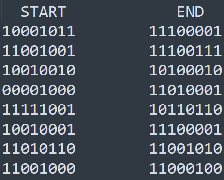
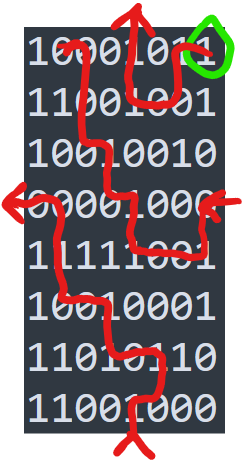

# floor is lava (Rev - 50)

> Don't touch the floor

---
## What we're given
We're given a single file, `chal` (a 64-bit ELF binary) that does the following.

1. Repeatedly asks us for an input.
2. Runs some sort of check on the input, telling us that "you fell into lava," presumably when we fail the check.
3. Hopefully prints the flag if we enter the right input.

It's not at all obvious what check is performed on the input, so we open up the binary in Ghidra.

---
## Disassembly - Ghidra

Looks like only single character inputs (followed by newlines) of `w`, `a`, `s` or `d` do anything, and we only take 28 of them.
Entries of `w` and `s` decrement and increment, respectively, some variable and entries of `a` or `d` do the same to some other variable.
The variables in question are adjacent to each other in the binary's `.bss` section, so they're probably y- and x-coordinates in some grid.
The fact that they live in the program's `.bss` section indicates that they're initialized to zero.
After each character is entered, the following block executes.
```C
x_coord = x_coord & 7;
y_coord = y_coord & 7;
(&DAT_00104010)[(int)(uint)y_coord] =
    (&DAT_00104010)[(int)(uint)y_coord] ^ (byte)(1 << x_coord);
```
So the coordinates are always considered modulo 8, which lets us think of our inputs as moving us around an 8x8 Pac-Man grid.
After each step, a byte in an array, indexed by the y-coordinate, has its bit in the spot corresponding to the x-coordinate flipped.
This array is in the program's `.data` section and we can see its initial state in Ghidra.
**In summary**, the program initializes a grid of 0's and 1's and we hop around this grid (looping around in both directions), flipping the bit where we land after each step.

---
## Avoiding the lava
After our 28 moves, the following executes (I cleaned this up just for readability here)
```C
int y = o;
int temp;
while(i < 8){
    srand(y * 0x1337 + 0xdeadbeef);
    temp = rand();
    if ((temp & 0xff) != (uint)(byte)(&grid)[y]) {
      puts("you fell into lava");
      exit();
    }
    y++;
}
```
So the final state of the grid after our hopping and bit-flipping has to match whatever is output by `rand()`.
Since we call `srand()` with eight known inputs, we know how `rand()` is seeded before each call, so we can predict what all eight outputs will be.

So in order to get the flag, we need to walk around the grid in a way so that our bit-flips cause the grid to end in a particular state.
This just boils down to solving a little 8x8 maze, which can easily be done by hand.


Our initial and target grids look like this.


So we follow this path.



I suppose we could have also "solved" for the flag by looking at the code that generates it, but solving this maze seems easier.

---

## Conclusion
The important nuggets here are
1. Variables in the `.bss` part are initialized to zero
2. If you know the input into `srand()` then you know the next output (and all subsequent outputs) of `rand()`.