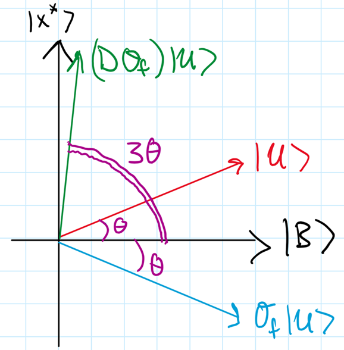

# quant? (misc. 72 pts)
> it's all math anyways. I heard predicting the future has been in vogue recently, so I hid the flag in a black-box oracle.
> Connect to the service and submit one OpenQASM-like circuit ending with END.
> `nc challs.umdctf.io 30309`
> The circuit has 16 input qubits q[0] through q[15], one ancilla qubit q[16], and a 16-bit classical register c[0] through c[15].
> Supported instructions:

    h q[i];
    x q[i];
    z q[i];
    mcx q[i],...,q[j];
    oracle q[0],q[1],q[2],q[3],q[4],q[5],q[6],q[7],q[8],q[9],q[10],q[11],q[12],q[13],q[14],q[15],q[16];
    diffuse q[0],q[1],q[2],q[3],q[4],q[5],q[6],q[7],q[8],q[9],q[10],q[11],q[12],q[13],q[14],q[15];
    measure q[i] -> c[i];
> You may include the usual OPENQASM 2.0;, include "qelib1.inc";, qreg q[17];, and creg c[16]; lines. Measure every input qubit as q[i] -> c[i].
> Limits: at most 250 oracle calls, 200000 bytes of input, and 512 shots. If your circuit places enough probability mass on the hidden marked state, the service prints the flag.
---

## What we're given
Connecting to the challenge server prints basically the same instructions given in the challenge description.
In short, we need to find a marked state given oracle access to some quantum circuit, 16 qubit registers, one ancilla qubit register, 16 (one-bit) classical registers and some standard quantum gates.
We're allowed to submit an OpenQASM program (basically, write a program that applies gates to the registers and then measure) with the restriction that we can only call the oracle 250 times and our program can't be insanely long.
The challenge server runs our program 512 times and we have to find the marked state "enough" times.

## About this writeup
This writeup is intended to be self-contained in the sense that I don't assume that you know anything about quantum computation (but maybe some basic linear algebra and the arithmetic of complex numbers).
If you already know the basics of quantum computation, you'll probably find this writeup way too verbose, in which case, you can probably just skip to either the explanation of Gover's algorithm or just to the "Applying it here" section.

---
## Background - qubits and quantum computation
While a classical bit can only take the value 0 or 1, a quantum bit, or _qubit_, is a _superposition_ (linear combination) of the orthogonal basis states $|0\rangle$ and $|1\rangle$ with unit length.
That is, the qubit $|\psi\rangle$ can be written $|\psi\rangle = \alpha |0\rangle + \beta |1\rangle$ where the complex numbers $\alpha, \beta$, called the _amplitudes_ of $|0\rangle$ and $|1\rangle$, respectively,  satisfy $|\alpha|^2 + |\beta|^2 = 1$.

We can do two things with qubits: apply unitary linear transformations to them and measure them.

- **Unitary time evolution**: If $|\psi_1\rangle$ is the state of our qubit at time $t = t_1$ and $|\psi_2\rangle$ is the state at time $t=t_2$, then there is some unitary transformation such that $|\psi_2\rangle = U|\psi_1\rangle$.
It's not tremendously important for us to define unitarity right now, but you can think of them as linear transformations from a space to itself that preserve length, like rotations and reflections.

    One example of a unitary transformation that will be helpful to us here is the _Hadamard gate_, $H$, defined by $H|0\rangle = \frac{1}{\sqrt 2}|0\rangle + \frac{1}{\sqrt 2}|1\rangle$ and $H|1\rangle = \frac{1}{\sqrt 2}|0\rangle - \frac{1}{\sqrt 2}|1\rangle$. 

- **Measurement**: There's a pretty general way to formulate measurement of a quantum state, but in the context of this problem, measuring the state $|\psi\rangle = \alpha |0\rangle + \beta |1\rangle$ yields the state $|0\rangle$ with probability $|\alpha|^2$ and the state $|1\rangle$ with probability $|\beta|^2$.
This is an instance of what people sometimes call "collapsing the wave function".

    For example, if we measure the state $|0\rangle$, the outcome will be $|0\rangle$ with probability 1 since the amplitude on $|0\rangle$ is 1.
    The same goes for measuring $|1\rangle$, we'll get $|1\rangle$ every time.
    But if we apply a Hadamard gate to an initial state of $|0\rangle$, so $H|0\rangle = \frac{1}{\sqrt 2}|0\rangle + \frac{1}{\sqrt 2}|1\rangle$ and then measure, we'll get $|0\rangle$ with probability $|\frac{1}{\sqrt 2}|^2 = \frac 12$ and $|1\rangle$ with probability $|\frac{1}{\sqrt 2}|^2 = \frac 12$.
    Similarly, if we start with $|1\rangle$, apply a Hadamard gate, $H|1\rangle = \frac{1}{\sqrt 2}|0\rangle - \frac{1}{\sqrt 2}|1\rangle$ and measure, we'll also get $|0\rangle$ with probability $\frac 12$ and $|1\rangle$ with probability $\frac 12$.
    In other words, if we start with either $|0\rangle$ or $|1\rangle$, measuring either of which has a completely deterministic outcome, and then apply a Hadamard gate, we get a _uniform superposition_ of $|0\rangle$ and $|1\rangle$, whose measurement outcome is a coin toss between $|0\rangle$ and $|1\rangle$.


Okay, that's one qubit, but what if we have a bunch of them?
The pithy answer is "just [tensor](https://en.wikipedia.org/wiki/Tensor_product) them together", but if you aren't familiar with tensor products, then you can think about the $n$-qubit system as a unit vector in the space spanned by by _all_ $n$-bit strings (so this system lives in $2^n$ (complex) dimensions).
So a two-quibit state looks like $\alpha_{00}|00\rangle + \alpha_{01}|01\rangle + \alpha_{10}|10\rangle + \alpha_{11}|11\rangle$, where these basis vectors are orthogonal and $|\alpha_{00}|^2 + |\alpha_{01}|^2 + |\alpha_{10}|^2 + |\alpha_{11}|^2 = 1$.
Our other two axioms still apply here: you can hit a multi-qubit state with unitary transformations or measure them by collapsing them to a basis state with the corresponding probability.

Putting it all together, if we start with $n$ qubits, each initialized to $|0\rangle$ and apply Hadamard to each of them, we'll end up with the state

$\underbrace{\left(\frac{1}{\sqrt 2}|0\rangle + \frac{1}{\sqrt 2}|1\rangle\right)\left(\frac{1}{\sqrt 2}|0\rangle + \frac{1}{\sqrt 2}|1\rangle\right) \cdots \left(\frac{1}{\sqrt 2}|0\rangle + \frac{1}{\sqrt 2}|1\rangle\right)}_{n\text{ terms}} = \sum_{x\in \{0,1\}^ n}\frac{1}{2^{n/2}}|x\rangle$,

the uniform superposition over _all_ $n$-bit strings!
That is, measuring this state will have the outcome $|x\rangle$ with probability $\frac{1}{2^n}$ for _every_ $n$-bit string $x$.
Here, we're taking the product of vectors $|x\rangle$ and $|y\rangle$ to be the vector formed by concatenating the bitstrings $x$ and $y$, i.e. $|x\rangle|y\rangle = |(x\vert\vert y)\rangle$.
This corresponds to the tensor product of these vectors, but again, we don't worry about rigorously defining that here.

## Unstructured search and quantum queries
If you had to find your name in the phone book, you might jump to the section of the book corresponding to the first letter of your last name and then hop back and forth there until you find your name. It probably wouldn't take you that long.
Now if I ripped all of the pages out of the book, jumbled them up, stapled them together and handed you the book again, you'd be pretty pissed at me.

In general, if we have a sorted list of $n$ items, then we can find an arbitrary item in $O(\log n)$ queries using something like [binary search](https://en.wikipedia.org/wiki/Binary_search). 
But if our list has no structure to it, then we'll have to look through all $n$ items in the worst case: no matter how many pages you check, your name might be on the next one.
One of the most celebrated results in quantum computation is Grover's algorithm, which says that we can find an arbitrary item in an unstructured list of $N$ items with only $O(\sqrt N)$ quantum queries!

But what do we even mean by a "quantum query"?
To make things concrete, suppose we're looking for one specific $n$-bit string $x^*$ in an unsorted list of all $N = 2^n$ $n$-bit strings.
In the classical setting, we can think of a query as submitting a bitstring $x$ to an oracle function $f$ and receiving $f(x)$, which is a 1 if $x = x^*$ and a 0 otherwise.
We might be tempted to think of a quantum query in a similar way: query the quantum oracle with the $n$-qubit state $|x\rangle$ and have it return $|1\rangle$ if $x = x^*$ and $|0\rangle$ otherwise.
The problem with this operation is that it's neither unitary nor a measurement: the only two things we can do with qubits!
It's not unitary because it's taking a vector $|x\rangle$ in $2^n$ dimensions (remember that we take _every_ bitstring $x$ to have a corresponding basis vector $|x\rangle$) and mapping it to a vector in two dimensions (spanned by $|0\rangle$ and $|1\rangle$) -- remember that a unitary transformation maps from a space to itself.
It's also not a measurement because measurements are only allowed to output basis states like $|y\rangle$ where $y$ is again an $n$-bit string, not a 1-bit string like $|0\rangle$ or $|1\rangle$.

One way out is to ask that our quantum oracle act on $n+1$ qubits by introducing an extra qubit (sometimes called an _ancilla_ qubit).
We submit the $n+1$ qubits $|x, b\rangle$ (where $b$ is a 0 or a 1) and receive back the $n+1$ qubits $|x, b \oplus f(x)\rangle$, where $f$ is the same classical oracle as before, i.e. $f(x) = 1$ if $x = x^*$ and $f(x) = 0$ otherwise.
This transformation, which we'll call $\mathcal O_f$, is indeed unitary since it just permutes the basis states of the $(n+1)$-qubit system: $\mathcal O_f|x, 0\rangle = |x, f(x)\rangle$ and $\mathcal O_f |x, 1\rangle = |x, \lnot f(x)\rangle$.

Here's a trick that effectively lets us forget about this ancillary qubit. Initialize the ancilla qubit to $|0\rangle$ (the default behavior in OpenQASM!) and then apply the unitary transformation $X$ that swaps the basis states: $X|0\rangle := |1\rangle$ and $X|1\rangle := |0\rangle$ (this gate is sometimes called the NOT gate).
So now our ancilla qubit is in state $|1\rangle$.
Now apply a Hadamard gate so we get $\frac{1}{\sqrt 2}|0\rangle - \frac{1}{\sqrt 2}|1\rangle$.
This state, which we call $|-\rangle$, interacts nicely with our oracle since

$\mathcal O_f|x, -\rangle = \mathcal O_f |x\rangle(\frac{1}{\sqrt 2}|0\rangle  - \frac{1}{\sqrt 2}|1\rangle) = |x\rangle (\frac{1}{\sqrt 2}|f(x)\rangle - \frac{1}{\sqrt 2}|\lnot f(x)\rangle) = |x\rangle (-1)^{f(x)}(\frac{1}{\sqrt 2}|0\rangle - \frac{1}{\sqrt 2}|1\rangle) = (-1)^{f(x)}|x, -\rangle$.

That is, $\mathcal O_f$ simply negates the input $|x, -\rangle$ if $f(x) = 1$ and does nothing otherwise.
This is sometimes called _phase kickback_ and it essentially lets us ignore the ancilla qubit that we set to $|-\rangle$, since the oracle never changes it, i.e., we can think of $\mathcal O_f$ as acting on just the first $n$ qubits by $\mathcal O_f|x\rangle = (-1)^{f(x)}|x\rangle$ (the implementation of the oracle in this problem still requires the ancilla qubit, but we'll just set it to $|-\rangle$ and forget about it afterwards).

## Grover's algorithm

Let's return to the unstructured search problem: find the special $n$-bitstring $x^*\in \{0, 1\}^n$ in an unordered list consisting of all $n$-bit strings.
If we're solving this in a quantum setting, let's think backwards for a second: what should the _last_ step of the algorithm look like?
We'll have some state $|\psi\rangle$ consisting of $n$ qubits and we hope that measuring results in the state $|x^*\rangle$.
We don't even need this to happen with probability 1: if it outputs $|x\rangle$ with some constant probability $0<p\leq 1$, then repeating Grover's algorithm $k$ times will find the desired state with probability $1 - (1-p)^k$, which can be made arbitrarily small for a chosen large $k$ (as a function of $p$).
So our goal becomes: manipulate the state $|\psi\rangle$ so that the magnitude of the amplitude on $|x^*\rangle$ is as large as possible.


An $n$-qubit state lives in $N = 2^{n}$ (complex) dimensional space, but let's zoom into the two dimensional plane spanned by the two vectors $|x^*\rangle$ and $|B\rangle:= \frac{1}{\sqrt{N-1}}\sum_{x\neq x^*}|x\rangle$.
This second state is a uniform superposition over all "bad" states, since these are the ones we are _not_ looking for.
Notice that the uniform superposition $|U\rangle := \frac{1}{\sqrt N}\sum_{x\in \{0, 1\}^n}|x\rangle$ lives in the plane spanned by $|x^*\rangle$ and $|B\rangle$ since $\frac{1}{\sqrt N}|x^*\rangle + \sqrt{\frac{N-1}{N}}|B\rangle = |U\rangle$.
Note that, while we cannot immediately prepare the states $|x^*\rangle$ or $|B\rangle$, since we do no know the bitstring $x^*$, we can prepare $|U\rangle$ by just initializing all 16 qubits to zero and applying a Hadamard gate to each of them.
We take $|U\rangle$ to be our starting point and write $|\psi_0\rangle = |U\rangle$.

The state $|U\rangle$ is pretty far from $|x^*\rangle$ when $n$ is large.
Indeed, if we let $\theta$ be the angle between $|U\rangle$ and $|B\rangle$, then

$|U\rangle = \frac{1}{\sqrt N}|x^*\rangle + \sqrt{\frac{N-1}{N}}|B\rangle = \sin\theta |x^*\rangle + \cos\theta |B\rangle$,

where we can think of $\theta$ as the angle that $|U\rangle$ makes with the $|B\rangle$-axis. So $\sin\theta = \frac{1}{\sqrt N}$, and since $\sin \theta \approx \theta$ when $\theta$ is small (equivalently, when $N = 2^n$ is large), we conclude that $\theta \approx \frac{1}{\sqrt N}$.
Consequently, if we measure $|U\rangle$ right away, we only have a probability of $\frac{1}{2^n}$ of obtaining $|x^*\rangle$.
So instead of measuring, we apply our oracle $\mathcal O_f$ first.
As discussed above, this has the effect of negating $|x^*\rangle$ and leaving $|B\rangle$ alone, so we obtain $-(\sin\theta)|x^*\rangle + \cos\theta |B\rangle$.

Consider the gate $D$ that reflects its input about the line spanned by $|U\rangle$.
This map, called the Grover _diffusion operator_ is indeed unitary (and included in the set of gates we're allowed to use in this challenge! (it can actually be built up from simpler gates, but they just give it to us here, so don't worry about that)) since it is a linear transformation that preserves lengths.
What happens when we apply $D$ to our current state $-(\sin\theta)|x^*\rangle +\cos\theta |B\rangle$?
Since $|U\rangle$ makes an angle of $\theta$ with $|B\rangle$, it must be the case that $\mathcal O_f|U\rangle$ makes an angle of $-\theta$ with $|B\rangle$, and reflecting about $|U\rangle$ brings us to an angle of $3\theta$ with $|B\rangle$.
Call this state $|\psi_1\rangle = \sin(3\theta)|x^*\rangle + \cos(3\theta)|B\rangle = (D\mathcal O_f)|U\rangle$.
A picture is worth a thousand words here.



Now the amplitude on $|x^*\rangle$ is larger and we have a bigger chance of this being the outcome of our measurement.
The idea is to repeat this some number of times $t$ to get the state $|\psi_t\rangle = (D\mathcal O_f)^t|U\rangle$.
Each application of $D\mathcal O_f$ increments the angle between the state and $|B\rangle$ by $2\theta$, i.e.

$|\psi_t\rangle = \sin[(2t+1)\theta]|x^*\rangle + \cos[(2t+1)\theta]|B\rangle$.

How many times should we repeat this?
If we want to maximize our chances of measurement yielding the state $|x^*\rangle$, then we want $\sin^2[(2t+1)\theta]$ to be as close to 1 as possible.
This will happen when $(2t+1)\theta \approx \frac{\pi}{2}$, and since $\theta \approx \frac{1}{\sqrt N}$, we obtain $t \approx \frac{\pi}{4}\sqrt N$.
If you're concerned with the accuracy of the approximations here, it's not too hard to show that for this choice of $t$, $|1 - \sin^2[(2t+1)\theta]| = 1 - O(\frac 1N)$, so our success probability is quite good as a function of $N$.


## Applying it here

We're looking for the marked state $|x^*\rangle$ for some unknown 16-bit string $x^*$.
The challenge gives us access to an oracle that detects $|x^*\rangle$ and the Grover diffusion operator, so we're precisely in the setting of Grover's algorithm.

The oracle here acts on sixteen qubits and one ancilla qubit, so we start by putting the ancilla (initialized to $|0\rangle$ ) into the $|-\rangle$ sate to use the phase kickback trick from earlier by applying an `x` gate followed by an `h` gate.
Then we prepare the uniform superposition by applying an `h` gate to each non-ancilla qubit.
We then apply the oracle followed by the Grover diffusion $\frac{\pi}{4} \sqrt{2^{16}} \approx 201$ times.
Finally, we measure and hopefully obtain the marked state.

```Python
from pwn import *
import subprocess

conn = remote('challs.umdctf.io', 30309)

# proof of work
conn.recvuntil(b'curl ')
pow_line = b'curl ' + conn.recvline().strip()
proof = subprocess.run(pow_line.decode(), shell=True, capture_output=True, text=True)
conn.sendline(proof.stdout.strip().encode())


# get to the input part
print(conn.recvuntil(b'measure every input qubit as q[i] -> c[i]'))
print(conn.recvline())


conn.sendline(b'OPENQASM 2.0;')
conn.sendline(b'include "qelib1.inc";')
conn.sendline(b'qreg q[17];')
conn.sendline(b'creg c[16];')


# put ancilla into |-> for phase kickback
conn.sendline(b'x q[16];')
conn.sendline(b'h q[16];')

# prepare uniform superposition
for i in range(16):
    conn.sendline(b'h q[%d];' % i)

# do grover
oracle_line = b'oracle q[0],q[1],q[2],q[3],q[4],q[5],q[6],q[7],q[8],q[9],q[10],q[11],q[12],q[13],q[14],q[15],q[16];'
diffuse_line = b'diffuse q[0],q[1],q[2],q[3],q[4],q[5],q[6],q[7],q[8],q[9],q[10],q[11],q[12],q[13],q[14],q[15];'
for i in range(201):
    conn.sendline(oracle_line)
    conn.sendline(diffuse_line)

# measure
for i in range(16):
    conn.sendline(b'measure q[%d] -> c[%d];' % (i, i))

conn.sendline(b'END')

print(conn.recvall())
```
