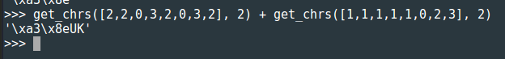
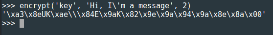
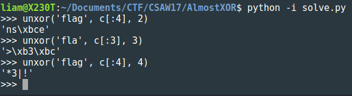
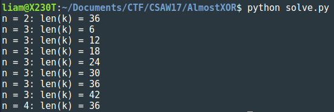

# Almost Xor
## Crypto - 200

#### Can you decode this ciphertext?
#### `809fdd88dafa96e3ee60c8f179f2d88990ef4fe3e252ccf462deae51872673dcd34cc9f55380cb86951b8be3d8429839`

We're given the above hex-encoded ciphertex and the file `almostxor.py` that was used to produce it. I think the best way to explain just what this bizarre cipher does is to walk through an example encryption. Let's encrypt the message `Hi, I'm a message` with the key `key`. In addition to taking a message and a key, the `encrypt()` function also takes a nonnegative integer `n` less than 8. For simplicity, let's use `n=2` (when `n=1`, the encryption reduces to a simple xor!). We repeat the key so that it's as long as our message and break the key and message up into blocks of size `n`. If our last block isn't two bytes long, we append a null byte:

```
Hi|, |I'|m |a |me|ss|ag|e\x00
ke|yk|ey|ke|yk|ey|ke|yk|e\x00
```

Now we take each block and run it through this function:

```python
def to_num(s):
	x = 0
	for i in range(len(s)): x += ord(s[-1-i]) * pow(256, i)
	return x
```

This function takes a string, treats it like an integer written in base-256, and spits out that integer. For example, since `H` and `i` are 72 and 105, respectively, in ASCII, `to_num('Hi') = (72*256) + 105 = 18537`. We apply this function to each of our two byte blocks:

```
18537, 11296, 18727, 27936, 24864, 28005, 29555, 24935, 25856
27493, 31083, 25977, 27493, 31083, 25977, 27493, 31083, 25856
```

Now we take each of these numbers and run it through this:

```python
def get_vals(x, n):
	vals = []
	mask = (1 << n) - 1
	for i in range(8):
		vals.append(x & mask)
		x = x >> n
	vals.reverse()
	return vals
```

This takes a number and writes it in base `2^n`, storing the digits in a list. We'll only write this out for a couple numbers here:
```
[1, 0, 2, 0, 1, 2, 2, 1][0, 2, 3, 0, 0, 2, 0, 0]...
[1, 2, 2, 3, 1, 2, 1, 1][1, 3, 2, 1, 1, 2, 2, 3]...
```

Now we go digit by digit and add vertically modulo `2^n`:

```
[1, 0, 2, 0, 1, 2, 2, 1][0, 2, 3, 0, 0, 2, 0, 0]...
[1, 2, 2, 3, 1, 2, 1, 1][1, 3, 2, 1, 1, 2, 2, 3]...
----------------------------------------------------AlmostXor
[2, 2, 0, 3, 2, 0, 3, 2][1, 1, 1, 1, 1, 0, 2, 3]...
```

This is where the challenge gets its name. If we were xor-ing, we would be adding two bitstrings modulo 2. Here we are adding modulo `2^n`. Finally, we just convert these back to characters by reversing the process that takes characters to base `2^n` integers. This is exactly what the function `get_chrs()` does:



For completeness's sake, here's the whole thing:



Great, now how do we break it? Well we can reverse this AlmostXor-ing process by just subtracting modulo `2^n` instead of adding. We write one function that does this subtraction on lists and another to use it to decrypt given a ciphertext, key, and `n`:

```python
#computes alist - blist
def subtract(alist, blist, n):
	return [(alist[i] - blist[i])%(2**n) for i in range(8)]

# 'subtracts' s1 - s2
def unxor(ciphertext, k, n):
	rep_key = k * (len(ciphertext) // len(k)) + k[:len(ciphertext) % len(k)]
	c_val_list = [get_vals(num, n) for num in get_nums(ciphertext, n)]# [ [list], [list]]
	rk_val_list = [get_vals(num, n) for num in get_nums(rep_key, n)]

	plaintext_list = [subtract(c_val_list[i], rk_val_list[i], n) for i in range(len(c_val_list))]

	return ''.join([get_chrs(lst, n) for lst in plaintext_list])
```


The superfluous byte at the end is just the result of padding. Much like in Crypto-100, we can use the fact that the message starts with `flag{` to get the first few bytes of the key. The problem is that we don't know what `n` is. We can at least narrow it down. Since we break our plaintext up into blocks of `n` bytes (with padding) to produce ciphertext blocks of `n` bytes, we have that `n` must divide the length of the ciphertext. Since our ciphertext is 48 bytes long, that gives us possibel values of `n` of 1, 2, 3, 4, and 6. We can pretty safely assume that `n` isn't 1 or else this would just be a simple xor, and I doubt the folks over at CSAW would go to such lengths to dress up such a simple problem. We put off the possibility that `n=6`. If `n` were 6, then to get the first key block we would have to guess the sixth byte of the flag. While this doesn't sound like much a problem, we would have to approach it a bit differently, so let's put this case aside for now.

For `n=2` we have two known 2-byte blocks in `flag{`, `fl` and `ag`. For `n=3`and 4 we have just one block of the required length, `fla` and `flag`. These give the following possible key prefixes, where `c` is the ciphertext decoded from the given hex:



Now just like with a repeating-key xor cipher, we proceed by guessing the key length. We know that when we decrypt the ciphertext, we should get printable characters at the positions of the known key bytes:

```python
k2 = 'ns\xbce'
k3 = '>\xb3\xbc'
k4 = '*3|!'

def try_block_length(n):
	if n == 2:
		k = k2
		known_bytes = 4
	if n == 3:
		k = k3
		known_bytes = 3
	if n == 4:
		k = k4
		known_bytes = 4

	for i in range(44):
		klen = len(k) + i
		message = unxor(c, k+('A'*i), n)
		all_printable = True
		for j in range(len(message)):
			if (j%klen < known_bytes) and message[j] not in string.printable:
				all_printable = False
				break
		if all_printable:
			print 'n = {}: len(k) = {}'.format(n, klen)

try_block_length(2)
try_block_length(3)
try_block_length(4)
```



36 bytes seems like an awfully long key compared to the size of our ciphertext. Let's try a block length of 3 bytes and a key length of 6 bytes. Since we know the first five bytes of the message, we only need to guess the sixth and check to see if the resulting key lets us decrypt the ciphertext and get something that looks like a flag:

```python
def try_decrypt():
	for char in string.printable:
		second_block = 'g{' + char
		k = k3 + unxor(c[3:6], second_block, 3)
		message = unxor(c, k, 3)

		all_printable = True
		for char2 in message:#flag should be printable
			if char2 not in string.printable:
				all_printable = False
				break
		if all_printable and '}' in message:#flag ends with }
			print message
```


Finally! This was a fun generalization of a cipher that shows up a lot in CTFs.