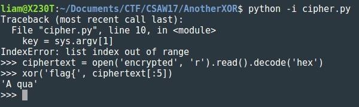

# Another Xor
## Crypto - 100

#### Hey, hey can you find my secret.

We're given two files: a text file with a hex-encoded encrypted message and the python script used to perform the encryption. Our task is, of course, to decrypt the message. Let's take a look at the python script:
```python
import hashlib
import sys

def xor(s1,s2):
    return ''.join(chr(ord(a) ^ ord(b)) for a,b in zip(s1,s2))

def repeat(s, l):
    return (s*(int(l/len(s))+1))[:l]

key = sys.argv[1]
plaintext = sys.argv[2] + key
plaintext += hashlib.md5(plaintext).hexdigest()
cipher = xor(plaintext, repeat(key, len(plaintext)))
print cipher.encode('hex')

# ciphertext: 
```

The hex-encoded ciphertext is `274c10121a0100495b502d551c557f0b0833585d1b27030b5228040d3753490a1c025415051525455118001911534a0052560a14594f0b1e490a010c4514411e070014615a181b02521b580305170002074b0a1a4c414d1f1d171d00151b1d0f480e491e0249010c150050115c505850434203421354424c1150430b5e094d144957080d4444254643`.

This cipher has pen-and-paper roots in the [Vigenère cipher](https://en.wikipedia.org/wiki/Vigen%C3%A8re_cipher), where a keyword is repeated so that it is as long as the plaintext and modular arithmetic gives the ciphertext. Here, we do pretty much the same thing - we repeat the key so that it is as long as our plaintext, except now we xor the plaintext and repeated key together to produce the ciphertext.

At first I wasn't sure what to make of the md5 hash part, but it ended up being this encryption scheme's downfall. The plaintext is the message followed by the key followed by the hex-encoded md5 hash of the concatenated message and key. The important thing to note here is that `hexdigest()` returns a _string_ of hex characters. Since an md5 hash is 16 bytes long, we get 32 characters when we represent it as a string and append it to our message and key. Our ciphertext is 137 bytes long, so the first 105 correspond to the message and key while the last 32 correspond to the hash.

We can easily get the first five bytes of the key since we know that the message starts with `flag{`. We simply xor the first five bytes of the ciphertext with `flag{`. Conveniently, the folks over at CSAW have already written a function that will do this xor for us. How sweet of them!



Five unique characters - so our key is at least five bytes long. Now to see why the md5 part will help us break this cipher, let's draw a little diagram of the decryption process:

```
[              ciphertext              ]
[key text][key text][key text][key text]
-------------------------------------------XOR
[message text][key text][hex characters]
```

When we xor the parts of the key that line up with the last 32 bytes of ciphertext with that part of the ciphertext, we know we have to get hex characters. Since we know the first five bytes of the key, we can simply keep trying different key lengths until we find one that makes this happen. Since our message and key have a combined total of 105 bytes, 99 bytes is a pretty generous upper bound on the key length.

```python
key_prefix = 'A qua'
with  open('encrypted', 'r') as cipher_file:
    cipher = cipher_file.read().decode('hex')

def guess_key_length():
    for i in range(94):
        k = key_prefix + ('A'*i)
        decryption = xor(cipher, repeat(k, len(cipher)))
        hopefully_hex = ''
        for j in range(105, len(decryption)):
            if j%len(k) < 5:
                hopefully_hex += decryption[j]
        try:
            num = int(hopefully_hex, 16)
            print(str(len(k)))
        except:
            pass
```


With the key length guessed, we can iteratively find the rest of the key. To see why, let's redraw our decryption diagram, representing unknown bytes of the key with `X`'s:

```
[                    ciphertext                    ]
[A quaXXXXXX][A quaXXXXXX][A quaXXXXXX][A quaXXXXXX]
------------------------------------------------------XOR
[   message text   ][A quaXXXXXX][ hex characters  ]
```
Notice now the beginning of the third key block lines up with unknown bytes of the key that appears in the plaintext. When we xor the ciphertext with the repeating key, we uncover those unknown bytes. We then add them to the key and repeat this process until all bytes of the key are uncovered. Finally, we can decrypt the ciphertex with the key:

```python
def decrypt():
    key = key_prefix + ('~' * 62) #key probably doesn't contain ~
    while '~' in key:
        plaintext = ''
        for i in range(len(cipher)):
            if key[i%67] == '~':
                plaintext += '~'
            else:
                plaintext += chr(ord(cipher[i]) ^ ord(key[i%67]))
        key = key_prefix + plaintext[43:105]
        

    print key
    message = xor(cipher, repeat(key, len(cipher)))[:38]
    print message
```